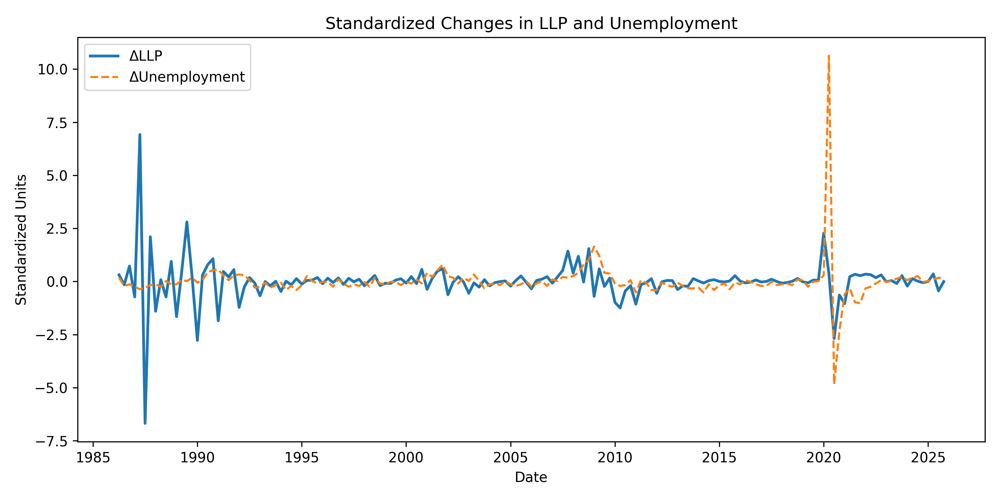

## What's a Bank?

---

## A Bank to us is:
- A place to store money securely
- A place to borrow money for big purchases
- A place to invest money for growth

---

## A Bank is a Business:
- The loans you take out are their products
- Banks make money by lending money, and charging for this service in the form of interest
- This type of product is risky however, sometimes people don't pay back their loans


---

## Imagine this Scenario:
- A bank loans out 1 million dollars to 100 customers
- Each customer is expected to pay back $10,000 with interest
- Because loans are risky, it's an overestimation to say that all 100 customers will pay back their loans

---

## Loan Loss Provisions (LLP)
- To prepare for potential losses, banks set aside a portion of their profits as an "Allowance for Loan Losses" (ALL)
- Loan loss provisioning is the process of estimating, adjusting and recording this allowance
- It acts as a financial buffer to absorb potential losses from defaulted loans

---

## Simple Idea:
- If banks expect more losses in the future -> they will increase their LLP
- If risk looks low -> they will decrease their LLP

---

## Loan Losses are Time Sensitive:
- When faced with increasing risk, banks must adjust their LLP to mitigate potential losses
- Banks can try to **anticipate** future losses
- Or they can **react** to losses once they are visible

---

## The Tradeoff:

---

## If Banks Adjust too Early:
- They might over-provision, which can reduce profitability and competitiveness
- Risk may be overestimated, leading to inefficient capital allocation
- It can signal to the market that the bank is in trouble, even if it isn't
- Fear of missing out / being left behind

---

## If Banks Adjust too Late:
- Losses appear suddenly, causing financial instability
- Profits drop sharply, compromising investor confidence
- Exposure to risk increases, potentially threatening the bank's long-term viability
- Fear of not getting out

---

## If Banks had Perfect Foresight:
- They would adjust their LLP perfectly in line with future losses
- They would recognize risk and adjust before these losses occur
- They would anticipate signals ahead of their competition, freeing up captial during good times, and building up buffers during bad times

---

## The Reality:
- Banks have imperfect information about the future, and must rely on noisy/uncertain signals to guide their decisions
- Acting too early isn't always a safe bet, it has costs
- LLP only adjusts quarterly, meaning a natural delay and potential to miss signals

---

## Research Question

### How do banks adjust loan loss provisions over time?

- Do banks **anticipate** economic downturns?
- Do they **react after conditions worsen?**
- Or do they adjust **at the same time** as the economy changes?

---

## Secondary Question

- What role can **data science** play in improving how banks recognize risk and set provisions?

---

## How Do We Study This?

> We want to understand **when** LLP responds to economic changes via a multi-signal, time-series analysis

- Not just whether economic changes variables are related to LLP
- But **how that relationship unfolds over time**

---

## What Do We Mean by Economic Changes?

Loan repayment is a conflux of economic factors...

We use a small set of indicators to capture different limitations on borrowers' ability to repay, and include metrics that signal credit risk/financial stress

---

## What Signals Do We Use?

We use indicators capturing different dimensions of risk:

---

## Unemployment Rate

- Measures the share of the labor force without a job  

---

### Why it matters

- Job loss reduces borrowers’ ability to repay loans  
- Higher unemployment → higher default risk  

**Captures household financial stress**

---

## Industrial Production

- Measures output in manufacturing, mining, and utilities  

---

### Why it matters

- Proxy for the greater economy as a whole
- Declining signal suggest slowing economic activity  
- Lower output → weaker income and business conditions  

**Captures real economic activity**

---


## Term Spread

- Difference between long-term and short-term interest rates for U.S. Treasury bonds

---

### Why it matters

- Reflects expectations about future economic conditions  
- Inversions often precede/predict recessions  

**Captures economic expectations and monetary conditions**

---

## Credit Spread

- Difference between corporate bond yields and safe government yields  

---

### Why it matters

- Wider spreads indicate higher perceived default risk  
- Reacts quickly to changes in financial conditions  

**Captures market-implied credit risk**

---

## National Financial Conditions Index (NFCI)

- Composite index of financial market stress  

---

### Why it matters

- Aggregates information from credit, leverage, and risk markets  
- Increases during periods of financial instability  

**Captures system-wide financial conditions**

---

## Small Business Optimism Index

- Survey-based measure of business expectations  

---

### Why it matters

- Reflects expectations about hiring, sales, and growth  
- Provides a forward-looking view of economic conditions  

**Captures business sentiment and expectations**

---

## From Economic Signals to Analysis

- We now have a set of indicators capturing different types of risk  

---

### The key question becomes:

> How does LLP respond to these signals over time?

---

## The Core Challenge

- Economic variables and LLP are both **time series**  
- Relationships are not instantaneous  

---

→ Responses may occur:

- Immediately  
- With delay  
- Or even in advance  

---

→ We need a framework to capture **timing**

---

## Our Approach

We use a simple - 3 step - time-series framework to study:

- **When** LLP responds  
- **How strongly** it responds  
- **How long** responses persist  

→ Focus is on **dynamic relationships**, not prediction

---

## Step 1 — Focus on Changes

- We convert all variables into **quarterly changes**

---

### Why?


- Removes long-term trends like bank sector growth  
- Makes variables comparable  
- Isolates **adjustment behavior** in the face of changing conditions

---

## Step 2 — Introduce Timing

We compare LLP today to:

- Current values of macro variables  
- Past values (**lags**)  
- Future values (**leads**)

---

## Leads and Lags

- **Lagged variables**  
  → Does LLP respond after changes occur?  

- **Contemporaneous variables**  
  → Does LLP move at the same time?  

- **Lead variables**  
  → Does LLP move before changes occur?  

---

→ This allows us to test **anticipation vs reaction**

---

## Step 3 — Regression Framework

We estimate relationships of the form:

- Changes in LLP explained by  
  - current signals  
  - past signals  
  - future signals  

---

→ This captures how LLP evolves **across time**

---

## What Are We Looking For?

Prediciting LLP is not within the scope of this analysis.

---

We are interested in:

- **Timing of responses**  
- **Direction of relationships**  
- **Consistency across variables**  

---

→ Do banks recognize risk **early, on time, or late?**

---

## Why This Framework Works

- LLP is a **dynamic adjustment process**  
- Economic signals evolve over time  

---

→ This framework allows us to observe:

- Information processing  
- Delays in response  
- Evidence of anticipation  

---

## How regression works as a tool for understanding timing:

- LLP is not set randomly  
- It responds to information about the economy  


---

### At each point in time:

- We ask:  
  → When a macro variable changes, how does LLP respond?

---

## The regression **quantifies this relationship**

→ The regression helps us trace:

- How information is processed  
- How quickly banks react  
- Whether they anticipate future risk

---

## Interpreting the Results

Each coefficient tells us:

- **Direction**  
  → Does LLP increase or decrease?  

- **Timing**  
  → Does the response happen before, during, or after?  

- **Strength**  
  → How large is the response?

---

## Model Choice

- OLS provides a **baseline, interpretable framework**  

---

- Allows us to isolate:

  - Timing effects  
  - Direction of relationships  
  - Consistency across variables  

---

→ More complex models can be explored later  
→ But OLS is ideal for **initial structural understanding**

---

## Why Not More Complex Models?

- Advanced models (e.g., machine learning, VARs):

  - Improve prediction  
  - But reduce interpretability  

---

### Tradeoff:

- Complex models → better fit  
- Simple models → clearer insight  

---

## Our Priority

→ The priority is **understanding behavior**, not maximizing accuracy

OLS is natural for our goals

---

## Results Overview

We build our analysis in stages:

1. Visual exploration
2. Single-variable models  
3. Financial indicators  
4. Timing structure (lags & leads)  
5. Combined model  
6. Regime analysis  

---

→ Goal: Understand how LLP responds over time

---

## Visual Analysis: LLP and Unemployment



- Standardized changes allow direct comparison  
- Some periods show alignment  
- Other periods show divergence  
- Relationship is volatile, but the shape is suggestive of a pattern

---

## Baseline Model: Unemployment

| Metric        | Value |
|--------------|-------|
| R²           | ~0.05 |
| Key Result   | Weak relationship |

- Some lagged effects are significant  
- No consistent timing pattern  

- LLP does not strongly track unemployment alone

---

## First Insight

- Real economy variables provide **limited explanatory power**  

- Suggests LLP is not driven by a single signal  

- Need broader, more forward-looking indicators

---

## Credit Spread Model

| Metric        | Value |
|--------------|-------|
| R²           | ~0.04 |
| Key Result   | Weak but significant contemporaneous effect |

- Immediate response is significant  
- Little persistence across lags  

---

→ LLP reacts to financial stress, but weakly

---

## Financial Conditions (NFCI)

| Metric        | Value |
|--------------|-------|
| R²           | ~0.23 |
| Key Result   | Stronger explanatory power |

- Significant at lag 0 and lag 2  
- Clearer dynamic pattern  

---

→ Financial conditions better explain LLP behavior

---

## Combining Signals

- The economy is **multi-dimensional**  
- No single variable captures overall risk  

---

### In practice:

- Banks observe **many signals simultaneously**  
- Risk emerges from a combination of factors  
- A single-variable model may miss important information

---

## Combined Model

| Metric        | Value |
|--------------|-------|
| R²           | ~0.45 |
| Observations | 154   |

---

- Substantial increase in explanatory power  
- Multiple variables contribute simultaneously  

---

→ LLP responds to a **combination of macro signals**

---

## Full Model (All Variables)

| Metric        | Value |
|--------------|-------|
| R²           | ~0.59 |
| Variables    | 30+   |

---

- Highest explanatory power observed  
- Many coefficients insignificant  
- Mixed signs across time  

---

→ Model captures broad information, but lacks clarity

---

## Interpreting the Full Model

- Many variables contain **overlapping information**  
- Econometric pitfall of multicollinearity

---

### Evidence:

- Loss of individual significance  
- Instability across lags and leads  
- Signals are **highly correlated**

---

## Key Insight:
- LLP is influenced by a **complex web of signals**
- No single variable dominates, multivariate analysis outperforms univariate

---

## What Mattered Most

- Financial conditions (NFCI) remain important  
- Unemployment still contributes 
- Other variables add noise when combined  

---

## Refocusing the Model

- The full model includes many overlapping signals  

---

### To improve clarity:

- We focus on the strongest variables:

  - Financial Conditions (NFCI)  
  - Unemployment  

- Provides a clearer view of LLP behavior

---

## Core Model (NFCI + Unemployment)

| Metric        | Value |
|--------------|-------|
| R²           | ~0.45 |
| Observations | ~150 |

---

- Strong explanatory power  
- More stable coefficients  
- Captures the key drivers of LLP

---

## One Last Adjustment:

## Why Consider Regimes?

- Economic conditions are not constant over time  

---

### In particular:

- Crisis periods differ from normal periods  
- Risk becomes more visible and urgent  
- LLP behavior may change depending on the environment

---

## Defining Regimes

We split the data into:

- **Normal periods**  
- **Crisis periods** (e.g., 2008, COVID)

→ Allows us to test whether behavior changes under stress

---

## Regime Analysis Method

- Extend the core model (NFCI + Unemployment)  

---

### Add interaction terms:

- Variable × Crisis indicator  

---

→ Measures how responses differ during crisis periods

---

## Regime Model Results

| Metric        | Value |
|--------------|-------|
| R²           | ~0.55 |


- Model fit improves further  
- Several interaction terms are significant  
- Evidence of different behavior in crisis periods

---

## Crisis vs Normal Behavior

### During crisis periods:

- Larger coefficient magnitudes  
- More statistically significant effects  
- Stronger and more persistent responses  

---

→ LLP becomes more reactive under stress

---

## Key Interpretation

- In normal times:
  → LLP adjusts gradually  

- In crisis periods:
  → LLP responds more aggressively  

---

→ Banks react more strongly when risk becomes clear

---

## Circling back to the Research Question:

We now understand:

  → What LLP responds to  
  → How responses change across environments  

---

## How did LLP respond over time?

---

## Timing Framework

Our Core model was built to include:

- Leads (t+1, t+2) -> 1-2 quarters in advance  
- Current values (t)  
- Lags (t−1, t−2, t−3) -> 1-3 quarters of reaction time

---

→ Allows us to trace how LLP responds **over time**

---

## Master Table of Results:

---

## Timing Results (Normal vs Crisis)

---

### Financial Conditions (NFCI)

| Period        | Lead 2 | Lead 1 | Lag 0 | Lag 1 | Lag 2 | Lag 3 |
|---------------|--------|--------|-------|-------|-------|-------|
| Normal        | +      | *      | +     | *     | *     | *     |
| Crisis Effect | (−)    | +      | +     | +     | +     | +     |

+ = significant positive  
− = significant negative  
( ) = marginal significance (p < 0.10)  
* = not significant

---

### Unemployment

| Period        | Lead 2 | Lead 1 | Lag 0 | Lag 1 | Lag 2 | Lag 3 |
|---------------|--------|--------|-------|-------|-------|-------|
| Normal        | *      | +      | +     | *     | *     | (−)    |
| Crisis Effect | −      | *      | +     | −     | *     | +     |


+ = significant positive  
− = significant negative  
( ) = marginal significance (p < 0.10)  
* = not significant

---

## 3 Important Takeaways:
- Co-movement during crisis
- Diffuse reactions to economic shock
- Weak evidience of anticipation

---

## Behavior Across Economic Conditions

- LLP more closely tracks macro conditions during crises  

- In stable periods:
  - We observe weaker relationships  
  - Less consistent adjustment patterns  
  - Insignificant timing effects

---

→ Provisioning behavior varies across economic regimes

---

## Visual Evidence


- Strong co-movement during crises (e.g., 2008)  
- Contrary motion during stable periods  
- Our lag/lead significance pattern is a reflection of this changing relationship

---

## Explanation:

- When risk is low, macro signals are less relevant to provisioning decisions
- During times of stability, banks may focus on other factors (e.g., competition, profitability, business metrics)
- Fear of being left behind - When the competition is not provisioning, it increases the opportunity cost of playing safe, even if risk is increasing in the background

---

## Diffuse Adjustment During Crises

- Economic shocks trigger immediate LLP responses  

- Adjustments continue over multiple quarters  

- Effects are distributed across time in a non-deterministic way  

---

→ LLP behaves as a **multi-period adjustment process**

---

## Interpretation

- Banks **respond** to worsening conditions once they are forced to 

- Adjustments are:
  - Gradual  
  - Ongoing  
  - Sometimes reversed
  - Not one-time decisions  

---

→ Risk recognition evolves as information becomes clearer

---

## Explanation:

- When risk becomes visible, banks adjust quickly to mitigate losses
- However, the adjustment process is not perfect or deterministic
- As conditions evolve, banks may need to adjust further, or even reverse course if conditions improve

---

## Weak Evidence of Anticipation

---

## Evidence on Anticipation

- Some lead terms are statistically significant  

---

### However:

- No time-period or variable with two significant leads 
- No time-period or variable with two leads of the same sign 
- No stable pattern across variables  

---

→ No strong evidence of systematic anticipation

---

## Explanation:

- To make the claim that banks anticipate risk, we would need consistent evidence of significant lead effects across multiple variables and time periods
- The lack of significant leads, and the incosistent pattern of signs, suggests that banks do not systematically adjust LLP in anticipation of future economic changes

---

## Interpreting Lead Effects

- Macroeconomic conditions are persistent  

- LLP responds over multiple quarters  

---

## My Theory

→ Lead significance may reflect:

- Ongoing adjustment to prior shocks  
- Overlapping timing effects  

---

→ Not true forward-looking behavior

---

## Final Interpretation

- LLP **responds** to worsening macroeconomic conditions, especially when crisis is unambiguous and risk is visible  

- Adjustments are:
  - Immediate  
  - Gradual  
  - Distributed over time  

- Responses strengthen during shocks 

- Little evidence of systematic anticipation  

---

## Answer to Research Question

Do banks anticipate macroeconomic risk?

- Limited evidence of anticipation  

- Provisioning responds:
  - Contemporaneously  
  - With lagged adjustments 

---

## In conclusion:

Provisioning behavior is **reactionary and state-dependent**

---

## Role of Data Science

- Current behavior is largely reactionary  

---

→ Opportunity to:

- Improve early risk detection  
- Incorporate forward-looking signals  
- Enhance consistency in provisioning decisions

---

## Key Takeaway

→ Loan loss provisioning is **not anticipatory**

→ It is a **gradual, reactionary process**

→ Stronger during periods of economic stress

---


```{python}
#| echo: false

# ================================
# 1. Imports
# ================================
import pandas as pd
import numpy as np
import statsmodels.api as sm

# ================================
# 2. Load Data
# ================================
df = pd.read_csv(
    "../data/processed/quarterly_llp_macro.csv",
    parse_dates=["DATE"],
    index_col="DATE"
).sort_index()

# ================================
# 3. First Differences
# ================================
vars_to_diff = [
    "llp_ratio",
    "unemployment",
    "indpro",
    "term_spread",
    "optimism_index",
    "credit_spread",
    "nfci"
]

for v in vars_to_diff:
    df[f"d{v.replace('_index','').replace('_spread','')}"] = df[v].diff()

# Rename for convenience
df = df.rename(columns={
    "dunemployment": "dunemp",
    "dterm": "dspread",
    "doptimism": "doptimism",
    "dcredit": "dcredit",
    "dnfci": "dnfci"
})

# ================================
# 4. Create Leads & Lags
# ================================
def create_leads_lags(df, var, lags=3, leads=2):
    for k in range(0, lags+1):
        df[f"{var}_lag{k}"] = df[var].shift(k)
    for k in range(1, leads+1):
        df[f"{var}_lead{k}"] = df[var].shift(-k)
    return df

for var in ["dunemp", "dindpro", "dspread", "doptimism", "dcredit", "dnfci"]:
    df = create_leads_lags(df, var)

# ================================
# 5. Crisis Indicator (example)
# ================================
df["crisis"] = ((df.index >= "2007-01-01") & (df.index <= "2010-12-31")).astype(int)

# ================================
# 6. Helper: Run OLS
# ================================
def run_model(df, y_var, X_vars):
    data = df[[y_var] + X_vars].dropna()
    X = sm.add_constant(data[X_vars])
    y = data[y_var]
    model = sm.OLS(y, X).fit(cov_type="HC1")
    return model

# ================================
# 7. Example Models
# ================================

# --- NFCI lag model
nfci_lags = [f"dnfci_lag{k}" for k in range(0,4)]
model_nfci = run_model(df, "dllp_ratio", nfci_lags)

# --- Credit lag model
credit_lags = [f"dcredit_lag{k}" for k in range(0,4)]
model_credit = run_model(df, "dllp_ratio", credit_lags)

# --- Lead + Lag NFCI
nfci_full = (
    [f"dnfci_lead{k}" for k in range(1,3)] +
    [f"dnfci_lag{k}" for k in range(0,4)]
)
model_nfci_full = run_model(df, "dllp_ratio", nfci_full)

# --- Full Multi-Signal Model
X_full = (
    [f"dnfci_lead{k}" for k in range(1,3)] +
    [f"dnfci_lag{k}" for k in range(0,4)] +
    [f"dunemp_lead{k}" for k in range(1,3)] +
    [f"dunemp_lag{k}" for k in range(0,4)]
)
model_full = run_model(df, "dllp_ratio", X_full)

# ================================
# 8. Crisis Interaction Model
# ================================
def add_crisis_interactions(df, vars_list):
    for v in vars_list:
        df[f"{v}_crisis"] = df[v] * df["crisis"]
    return df

df = add_crisis_interactions(df, X_full)

X_crisis = X_full + [f"{v}_crisis" for v in X_full]
model_crisis = run_model(df, "dllp_ratio", X_crisis)

# ================================
# 9. Store Results
# ================================
results = {
    "credit": model_credit,
    "nfci": model_nfci,
    "nfci_full": model_nfci_full,
    "full": model_full,
    "crisis": model_crisis
}
```