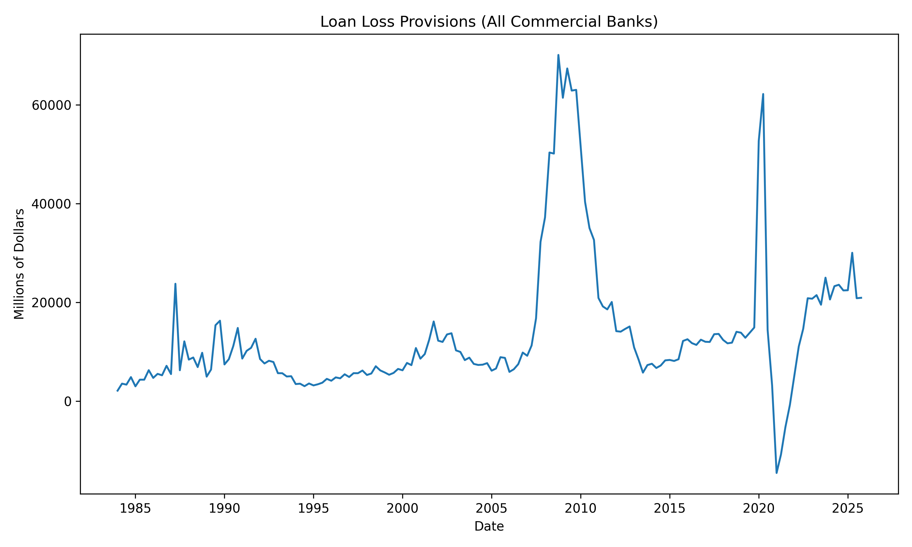
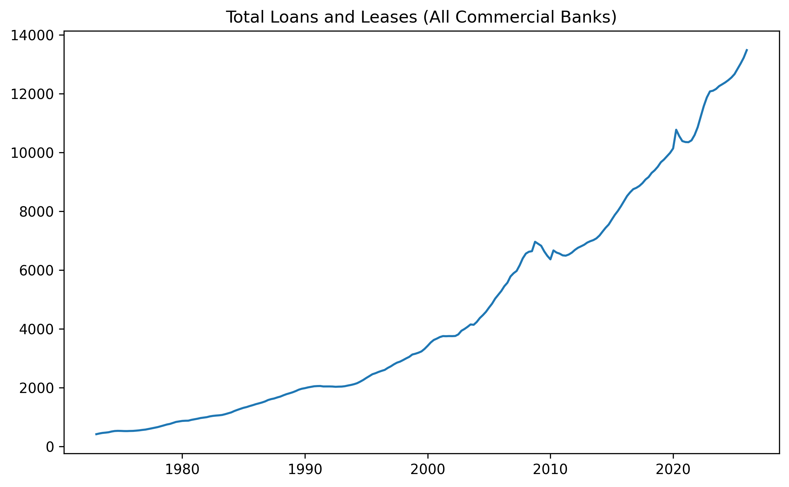
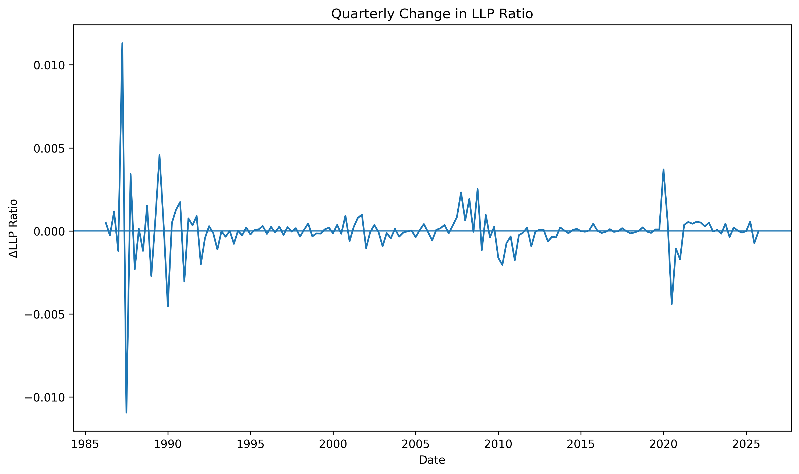
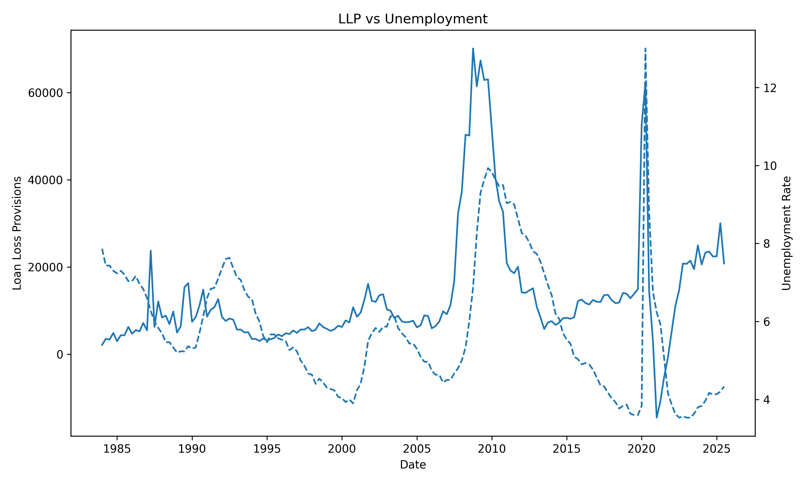

---
```{python}

#| echo: false
# Regression Carryover

# ================================
# 1. Imports
# ================================
import pandas as pd
import numpy as np
import statsmodels.api as sm
import matplotlib.pyplot as plt

# ================================
# 2. Load Data
# ================================
df = pd.read_csv(
    "../data/processed/quarterly_llp_macro.csv",
    parse_dates=["DATE"],
    index_col="DATE"
)

df = df.sort_index()

# ================================
# 3. Construct First Differences
# ================================
df["dllp_ratio"] = df["llp_ratio"].diff()
df["dunemp"] = df["unemployment"].diff()
df["dindpro"] = df["indpro"].diff()
df["dspread"] = df["term_spread"].diff()
df["doptimism"] = df["optimism_index"].diff()

# ================================
# 4. Create Lagged Variables (0–3)
# ================================
for k in range(0, 4):
    df[f"dunemp_lag{k}"] = df["dunemp"].shift(k)
    df[f"dindpro_lag{k}"] = df["dindpro"].shift(k)
    df[f"dspread_lag{k}"] = df["dspread"].shift(k)
    df[f"doptimism_lag{k}"] = df["doptimism"].shift(k)

# ================================
# 5. Build Regression Datasets
# ================================

# Unemployment-only
cols_unemp = ["dllp_ratio"] + [f"dunemp_lag{k}" for k in range(0,4)]
df_unemp = df[cols_unemp].dropna()

# Optimism-only
cols_opt = ["dllp_ratio"] + [f"doptimism_lag{k}" for k in range(0,4)]
df_opt = df[cols_opt].dropna()

# Multi-signal
cols_multi = ["dllp_ratio"] + \
             [f"dunemp_lag{k}" for k in range(0,4)] + \
             [f"dindpro_lag{k}" for k in range(0,4)] + \
             [f"dspread_lag{k}" for k in range(0,4)] + \
             [f"doptimism_lag{k}" for k in range(0,4)]

df_multi = df[cols_multi].dropna()

# ================================
# 6. Run Regressions
# ================================

# Unemployment model
X_unemp = sm.add_constant(df_unemp[[f"dunemp_lag{k}" for k in range(0,4)]])
y_unemp = df_unemp["dllp_ratio"]
model_unemp = sm.OLS(y_unemp, X_unemp).fit(cov_type="HC1")

# Optimism model
X_opt = sm.add_constant(df_opt[[f"doptimism_lag{k}" for k in range(0,4)]])
y_opt = df_opt["dllp_ratio"]
model_opt = sm.OLS(y_opt, X_opt).fit(cov_type="HC1")

# Multi-signal model
X_multi = sm.add_constant(df_multi.drop(columns=["dllp_ratio"]))
y_multi = df_multi["dllp_ratio"]
model_multi = sm.OLS(y_multi, X_multi).fit(cov_type="HC1")

# ================================
# 7. Print Summaries (optional)
# ================================


```
---
## What Are Loan Loss Provisions (LLP)?

- Banks make loans → some will **not be repaid**

- LLP = money set aside **today** for those expected future losses

---

### Simple Idea

- If a bank expects more loans to fail → it increases LLP  
- If risk looks low → LLP stays low  

---

### Why it matters

- LLP directly reduces **profits** and **liquidity**
- It reflects how banks **recognize risk over time**

---

## Why Does Timing Matter?

---

### If banks act too early:
- Profits are reduced unnecessarily  
- Risk may be overstated  
- Fear of missing out

---

### If banks act too late:
- Losses appear suddenly during downturns  
- Profits and capital drop sharply  
- Financial stability and ability to operate are threatened

---

## What Would Banks Ideally Do?

### If they had perfect foresight:

- Banks would recognize risk **before losses occur**
- LLP would adjust **as soon as future problems are expected**

---

### But in reality:

- Economic signals are **uncertain and noisy**
- Early warnings may be **wrong or misleading**
- Acting too early can reduce profits unnecessarily

---

### So banks face a tradeoff:

> Act early and risk being wrong  
> or  
> Wait for confirmation and risk being late


## Research Question

### How do banks adjust loan loss provisions over time?

- Do banks **anticipate** economic downturns?
- Do they **react after conditions worsen?**
- Or do they adjust **at the same time** as the economy changes?

---

### Secondary Question

- What role can **data science** play in improving how banks recognize risk and set provisions?

---

## How Do We Study This?

We use a set of standard time-series tools to study timing

---

### Methods used:

- **First differences**
  → Focus on *changes* rather than levels  

- **Lagged variables**
  → Track how responses unfold over time  

- **Regression analysis**
  → Measure relationships between LLP and macro signals to understand how they move across time 

---

### Goal:

> Determine whether LLP responds **before, during, or after** economic changes


## What Do We Mean by Economic Changes?

We use a small set of indicators to capture different parts of the economy

---

### Labor Market

- **Unemployment rate**
  → Are people losing jobs?

---

### Real Economic Activity

- **Industrial production**
  → Is the economy growing or slowing down?

---

### Financial Conditions

- **Interest rate spread (long vs short rates)**
  → Is credit becoming tighter?

---

### Business Expectations

- **Small business optimism index**
  → How confident are firms about the future?


## How Do We Analyze Timing Based on Macro Signals?

We focus on how changes in LLP relate to changes in the economy / our variables over time

---

### Step 1 — Focus on Changes

- We study how variables **change from quarter to quarter**
- This helps isolate **when adjustments occur**

---

### Step 2 — Introduce Timing

- We compare LLP today to economic changes:
  - in the same quarter  
  - in previous quarters  

---

### Step 3 — Measure the Relationship

- We use regression to quantify how LLP and macro signals  
  **move together across time**


## Loan Loss Provisions Over Time



---

## Growth of the Banking System



- Total loans increase steadily over time  
- Reflects long-term growth in the banking system  
- Makes level-based comparisons misleading  

---

## Changes in Loan Loss Provisions (ΔLLP)



- Focus on quarter-to-quarter changes  
- Captures adjustment behavior  
- Removes long-term trend effects  

---

## LLP vs Unemployment (Changes)



- Relationship is visible, but inconsistent  
- Periods of alignment and divergence  
- No clear, stable pattern over time  

---

## Unemployment and LLP: Regression Results

| Metric        | Value |
|--------------|-------|
| R²           | 0.050 |
| Observations | 156   |
| Key Result   | Weak explanatory power |

- Some lagged effects are significant  
- No consistent timing pattern  
- Relationship is unstable  

---

## Optimism and LLP: Regression Results

| Metric        | Value |
|--------------|-------|
| R²           | 0.053 |
| Observations | 156   |
| Key Result   | Weak explanatory power |

- Contemporaneous effect is significant  
- Other lags show little consistency  
- No clear timing pattern  